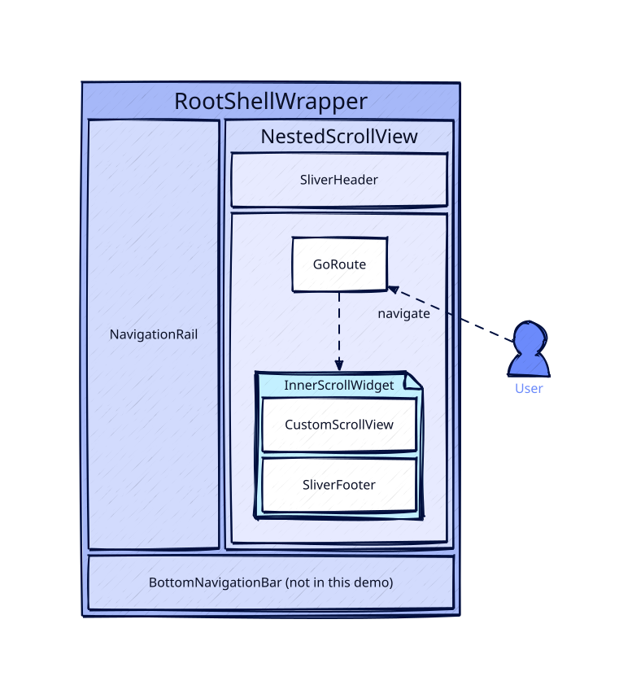

# NestedHomePage

Based on [flutter#129523](https://github.com/flutter/flutter/issues/129523) a navigator cannot be placed within a scrollable.
If you'd like to create a ShellRoute which allows every route to scroll and share a SliverHeader you have to do some heavy lifting.
This repo is an implementation demo how one can archive such task.

## Requirements
- SliverAppBar sits on top of all routes
- Footer can be defined at one place and not in every route
- SliverAppBar should not scroll if the content does not overflow the page
- Footer which is located after the routes content and stays on the bottom of the viewport if the content is too small
- Page Animations which only happen within the Frame
- Wrapper Frame needs to know when route changes, to rebuild navigation elements
- Route should be notified once it gets visible again for API refresh

## Setup

<p align="center">
  
</p>

```bash
[GoRouter] Full paths for routes:
           ├─/ (Widget)
           ├─ (StatefulShellRoute)
           │ ├─/stateful/order (Widget)
           │ │ └─/stateful/order/detail (Widget)
           │ └─/stateful/user (Widget)
           │   └─/stateful/user/detail (Widget)
           ├─ (ShellRoute)
           │ ├─/stateless/order (Widget)
           │ │ └─/stateless/order/detail (Widget)
           │ └─/stateless/user (Widget)
           │   └─/stateless/user/detail (Widget)
           └─/settings (Widget)
           known full paths for route names:
             Home => /
             Order Overview (state) => /stateful/order
             Order Detail (state) => /stateful/order/detail
             User Overview (state) => /stateful/user
             User Details (state) => /stateful/user/detail
             Order Overview => /stateless/order
             Order Detail => /stateless/order/detail
             User Overview => /stateless/user
             User Detail => /stateless/user/detail
             Settings => /settings
```

The `RootShellWrapper` is setup to work with `ShellRoute` and `StatefulShellRoute`.
This required some hacks to get the currentIndex and determine the next NavigationDestination in the NavigationRail.

The stateful and stateless routes share the same underlaying page.
To make it clearer which page is shown the header and footer adjust the color based whether they're in a `StatefulNavigationShell`.